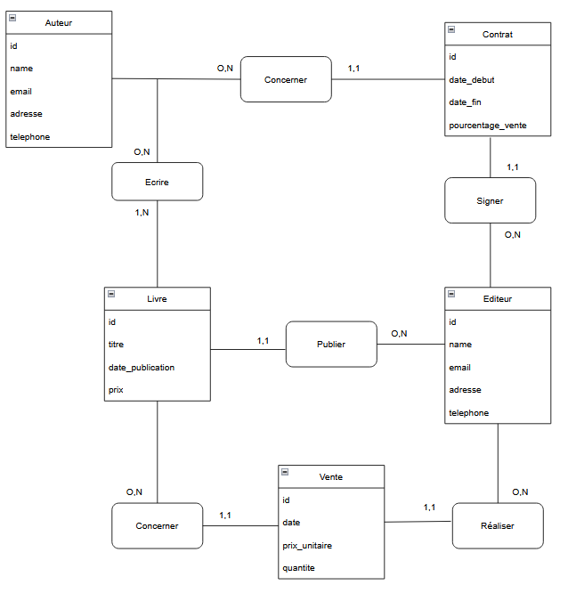
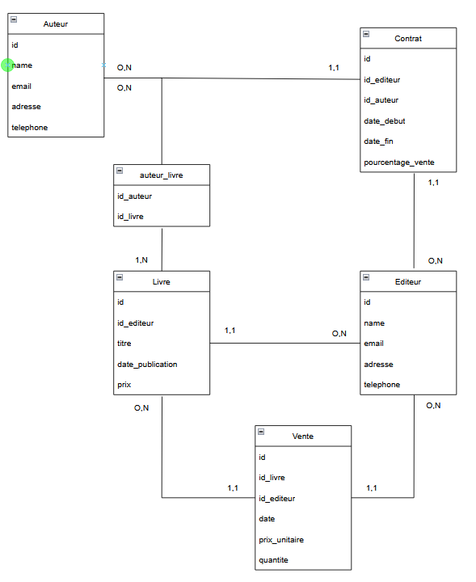

### Modélisation 2

## Phase 1 - Analyse conceptuelle




## Phase 2 - Transformation technique




## Phase 3 - Implémentation partielle

```bash
CREATE TABLE Auteur (
    id INT AUTO_INCREMENT PRIMARY KEY,
    name VARCHAR(100) NOT NULL,
    email VARCHAR(255) NOT NULL UNIQUE,
    adresse VARCHAR(255) NOT NULL,
    telephone VARCHAR(30) NOT NULL
);

INSERT INTO `auteur` (`id`, `name`, `email`, `adresse`, `telephone`) VALUES 
(NULL, 'Brice rubeaux', 'brice.rubeaux@plop.fr', '3 la bastille', '02.03.04.05.06'), 
(NULL, 'Machin', 'machin.truc@test.fr', '2 place de la Jamaique', '02.03.04.05.06');

CREATE TABLE Editeur (
    id INT AUTO_INCREMENT PRIMARY KEY,
    name VARCHAR(100) NOT NULL,
    email VARCHAR(255) NOT NULL UNIQUE,
    adresse VARCHAR(255) NOT NULL,
    telephone VARCHAR(30) NOT NULL
);

INSERT INTO `editeur` (`id`, `name`, `email`, `adresse`, `telephone`) VALUES 
(NULL, 'Jean Valjean', 'jean.valjean@bastille.fr', '3 la bastille', '02.03.04.05.06'), 
(NULL, 'Pierpoljak', 'pierpoljak@reggae.fr', '2 place de la Jamaique', '02.03.04.05.06');

CREATE TABLE Livre (
    id INT AUTO_INCREMENT PRIMARY KEY,
    id_editeur INT NOT NULL,
    titre VARCHAR(255) NOT NULL,
    date_publication DATE,
    prix DECIMAL(10,2) NOT NULL CHECK (prix >= 0),
    FOREIGN KEY (id_editeur) REFERENCES Editeur(id)
);

INSERT INTO `livre` (`id`, `id_editeur`, `titre`, `date_publication`, `prix`) VALUES 
(NULL, '1', 'tintin au Pérou', '2025-08-13', '15'), 
(NULL, '2', 'Lucky Luke', '2025-08-12', '14');

CREATE TABLE Auteur_Livre (
    id_auteur INT NOT NULL,
    id_livre INT NOT NULL,
    PRIMARY KEY (id_auteur, id_livre),
    FOREIGN KEY (id_auteur) REFERENCES Auteur(id),
    FOREIGN KEY (id_livre) REFERENCES Livre(id)
);

INSERT INTO `auteur_livre` (`id_auteur`, `id_livre`) VALUES 
('1', '1'), ('2', '2');

CREATE TABLE Contrat (
    id INT AUTO_INCREMENT PRIMARY KEY,
    id_editeur INT NOT NULL,
    id_auteur INT NOT NULL,
    date_debut DATE NOT NULL,
    date_fin DATE,
    pourcentage_vente DECIMAL(5,2) NOT NULL CHECK (pourcentage_vente BETWEEN 0 AND 100),
    FOREIGN KEY (id_auteur) REFERENCES Auteur(id),
    FOREIGN KEY (id_editeur) REFERENCES Editeur(id)
);

INSERT INTO `contrat` (`id`, `id_editeur`, `id_auteur`, `date_debut`, `date_fin`, `pourcentage_vente`) VALUES 
(NULL, '1', '1', '2022-08-18', '2026-08-28', '15'), 
(NULL, '2', '2', '2020-06-18', '2027-08-28', '25');

CREATE TABLE Vente (
    id INT AUTO_INCREMENT PRIMARY KEY,
    id_livre INT NOT NULL,
    id_editeur INT NOT NULL,
    date DATE NOT NULL,
    prix_unitaire DECIMAL(10,2) NOT NULL CHECK (prix_unitaire >= 0),
    quantite INT NOT NULL CHECK (quantite > 0),    
    FOREIGN KEY (id_livre) REFERENCES Livre(id),
    FOREIGN KEY (id_editeur) REFERENCES Editeur(id)
);

INSERT INTO `vente` (`id`, `id_livre`, `id_editeur`, `date`, `prix_unitaire`, `quantite`) VALUES 
(NULL, '2', '2', '2025-08-06', '14', '3'), 
(NULL, '1', '1', '2025-08-22', '15', '14');

```

### Documentation

| Table          | Rôle / Justification                                                                                                                                           |
| -------------- | -------------------------------------------------------------------------------------------------------------------------------------------------------------- |
| `Auteur`       | Contient les auteurs avec leurs coordonnées. Chaque auteur a un `email` unique. Les attributs `adresse` et `telephone` permettent de gérer le contact complet. |
| `Editeur`      | Contient les éditeurs, avec coordonnées complètes et `email` unique. Chaque éditeur peut publier plusieurs livres et signer plusieurs contrats.                |
| `Livre`        | Contient les livres publiés. Chaque livre est lié à **un éditeur** via `id_editeur`. Le `prix` est obligatoire et ≥0.                                          |
| `Auteur_Livre` | Table de jointure pour gérer la relation N,N entre auteurs et livres. Un livre peut avoir plusieurs auteurs et un auteur peut écrire plusieurs livres.         |
| `Contrat`      | Relie un auteur à un éditeur avec un pourcentage de vente. Les contraintes CHECK assurent que le pourcentage est entre 0 et 100.                               |
| `Vente`        | Enregistre les ventes de livres, liées à un éditeur et à un livre. Les contraintes `quantite >0` et `prix_unitaire ≥0` respectent les règles métier.           |
